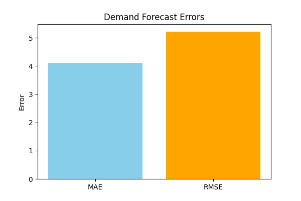

📦 Stockout Forecasting – Demand Prediction & Risk Analysis
📌 Overview

This project predicts stockout risk at the SKU–location level and generates demand forecasts to help optimize replenishment decisions.

It uses:

Demand Forecasting Model → predicts future sales demand (Random Forest Regressor)

Stockout Risk Model → classifies whether a stockout will occur (Random Forest Classifier)

The pipeline ingests daily inventory, sales, orders, and lead time data, builds features, trains models, and outputs:

Forecasted demand

Stockout risk predictions

Evaluation metrics (MAE, RMSE, Accuracy)

Visualizations (accuracy graph, confusion matrix, heatmaps)

📂 Project Structure
Stockout Forecasting/
│
├── archive/
│   └── supply_chain_dataset1.csv   # Input dataset
│
├── demand_model.pkl                # Trained demand forecast model
├── stockout_model.pkl              # Trained stockout risk model
├── processed_inventory.h5          # Feature-engineered dataset
├── prediction_results.csv          # Final predictions (demand + stockout flag)
│
├── insights.json                   # Metrics & top risky SKUs
├── build_metadata.yaml             # Pipeline metadata
│
├── viz_demand_accuracy.png         # Demand forecast error (MAE vs RMSE)
├── viz_stockout_confusion_matrix.png # Stockout classifier confusion matrix
├── viz_stockout_risk_heatmap.png   # Stockout risk by SKU & warehouse
├── viz_service_vs_cost.png         # Service level vs cost trade-off curve
└── viz_demand_forecast_<sku>.png   # Demand trend for sample SKU

⚙️ Setup Instructions (Windows)
1. Create environment
cd "C:\Users\NXTWAVE\Downloads\Stockout Forecasting"
python -m venv .venv
.\.venv\Scripts\activate

2. Install dependencies
pip install -U pip
pip install pandas numpy scikit-learn matplotlib seaborn pyyaml joblib tables

🚀 Usage
1. Train Models + Save Artifacts

Run the Jupyter notebook cell (or script) to:

Load dataset (supply_chain_dataset1.csv)

Build features (rolling demand, volatility, days of cover, etc.)

Train demand & stockout models

Save models (.pkl), features (.h5), metadata (.yaml), insights (.json)

Generate plots

2. Evaluate Performance

The notebook prints:

Demand Forecast Metrics → MAE, RMSE

Stockout Classifier Metrics → Accuracy

Visuals:

viz_demand_accuracy.png → bar chart of MAE & RMSE

viz_stockout_confusion_matrix.png → heatmap of confusion matrix

3. Generate Predictions

Use the prediction script to load saved models and make predictions:

python predict.py

Outputs:

prediction_results.csv with columns:

Date	SKU_ID	Warehouse_ID	Units_Sold	Inventory_Level	predicted_demand	predicted_stockout_flag
📊 Outputs & Insights

demand_model.pkl – trained demand forecasting pipeline

stockout_model.pkl – trained stockout classifier

prediction_results.csv – demand forecast & stockout prediction for each SKU-location-day

insights.json – top risky SKUs, metrics (MAE, RMSE, Accuracy)

Visualizations:

Service level vs cost curve

Stockout risk heatmap by SKU-location

Demand forecast plots

💡 Business Impact

Prevent lost sales by identifying stockout risk early

Reduce excess inventory via accurate demand forecasting

Spotlight risky SKUs/suppliers driving service level gaps

Balance cost vs service level with trade-off insights

🔮 Next Steps

Extend pipeline with Replenishment Plan (replenishment_plan.csv) to compute:

ROP (Reorder Point)

ROQ (Reorder Quantity)

Next Order Date

Add stockout probability scores (not just classification)

Automate daily updates & scheduling
AUTHOR
SAGNIK PATRA
